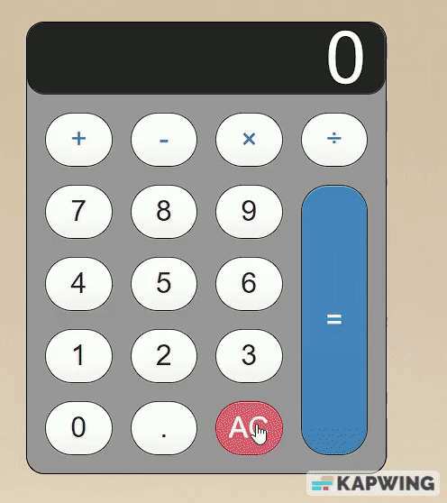

# Welcome to countOnMe!
## A quick and easy to use calculator 
This is a simple arithmetic calculator app built using HTML, CSS, and JavaScript. The app can be used to perform basic arithmetic operations like addition, subtraction, multiplication, and division.

### Usage
To use the calculator, simply click on the numbers or operators you want to use. The calculator will display the results of your operations in real-time.

### Buttons
The following buttons are available for use in the calculator:

Numbers: 0-9
Operators: +, -, *, /

### How to perform operations
To perform an operation, follow these steps:

* Click on the first number in the calculation.
* Followed by the desired operator (+, -, *, /).
* Click on the second number you want to use.
* Repeat the previous steps as many times as needed until all numbers have been included.
* Finally click on the equal sign (=) to display the result.
The calculator will display the result of your operation in the display screen.

Clearing the display
To clear the display, click on the AC button. This will clear the display and reset the calculator.

### Features To Come
* Keyboard functionality has not been added to this version of the app, but it may be added in a future release.
